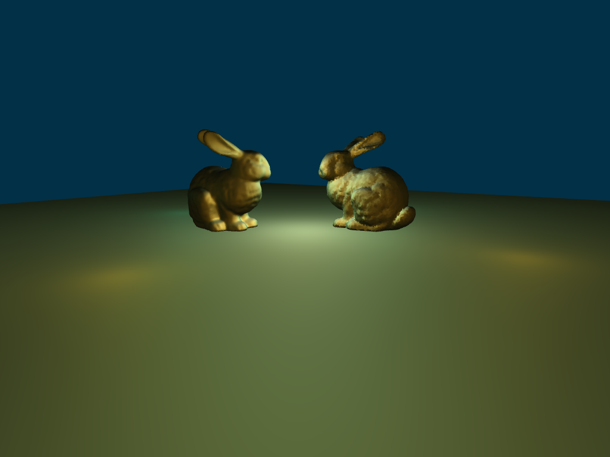

# 2 Bunnies

## Trabalho da disciplina Computação Gráfica

---

### Enunciado

Usando o código base, desenvolvido durante as aulas do nosso curso, construa uma aplicação gráfica que atenda aos seguintes requisitos:

1) A aplicação deve contar uma cena composta por duas instâncias do modelo stanford bunny, em anexo, um de frente para o outro.
2) A cena deve vista a partir de uma câmera virtual, que ficará constantemente em órbita em torno dos coelhos (efeito do filme Matrix).
3) A cena deve conter duas fontes de luz, uma branca e outra amarela.
4) A aplicação deve permitir que o usuário alterne entre o uso de projeções ortogonais e perspectivas.

---

### Observações sobre a implementação

* É necessário um servidor para fornecer a página . Durante o desenvolvimento foi utilizado a extensão Live Server do VSCode.

* Usando a projeção perspectiva, é possível modificar o volume de visão através da interface do usuário somente através do campo near e far do tamanho do mundo (ficou faltando o input do fovy na interface).

* Tenha em mente que apesar do leitor de arquivos .ply ser capaz de ler arquivos arbitrários desse tipo, há a limitação de que o gerador de modelos 3D está escrito para criar faces com somente tres vertices.

* Os arquivos .ply.js são usados para carregar a cena sem a necessidade do usuario fornecer os arquivos .ply através do seletor de arquivos.

* Com a implementação feita, modelos que utilizam o mesmo arquivo .ply não compartilham os mesmos buffers de indices e de vértices.
